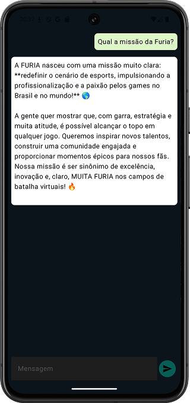

# FuriaTalk

## Table of Contents

- [Introdução](#introdução)
- [Preview](#preview)
- [Tecnologias Utilizadas](#tecnologias-utilizadas)
- [Como Usar](#como-usar)

## Introdução
- FuriaTalk é um aplicativo Android desenvolvido utilizando Kotlin Multiplatform para a etapa do desafio técnico para a vaga de Assistente de Engenharia de Software na FURIA
- Este aplicativo é um chat bot, que o usuário pode interagir com IA do Gemini acerca de qualquer assunto sobre a FURIA

## Preview

## Tecnologias Utilizadas
- [Kotlin Multiplatform](https://kotlinlang.org/docs/multiplatform.html)
- [Jetpack Compose](https://developer.android.com/develop/ui/compose)
- [Koin](https://insert-koin.io) Injeção de Dependências
- [Ktor](https://ktor.io/) Chamadas à API
- [Coroutines](https://kotlinlang.org/docs/coroutines-overview.html) Operações Assíncronas
- [SqlDelight](https://sqldelight.github.io/sqldelight/2.0.2/) para cache de dados
- [Gemini](https://gemini.google.com/app)

## Como Usar
1. Clone este repositório `git clone https://github.com/GuilhermeIgnacio/FuriaTalk`
2. Abra este projeto no Android Studio
3. Certifique-se de substituir o valor da constante [API_KEY](composeApp/src/commonMain/kotlin/com/guilherme/furiatalk/chat/data/api/GeminiServiceImpl.kt) pela sua Api Key do Gemini Studio
4. Faça o build e execute o projeto no seu dispositivo ou emulador Android

### Ou:

- Faça o Download do APK [aqui](composeApp/release/composeApp-release.apk)

---